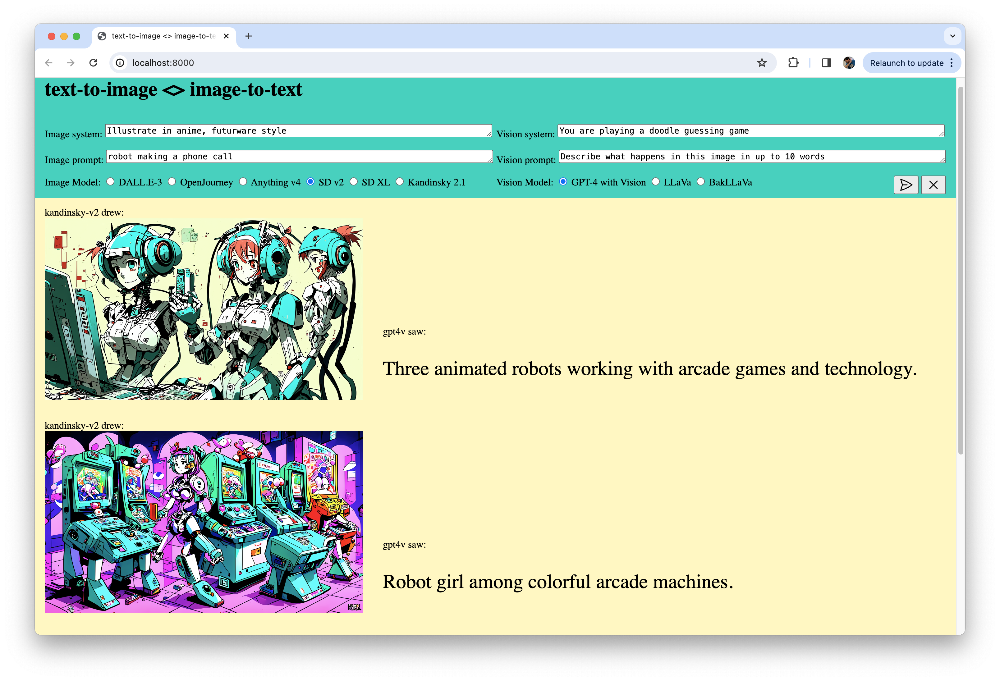
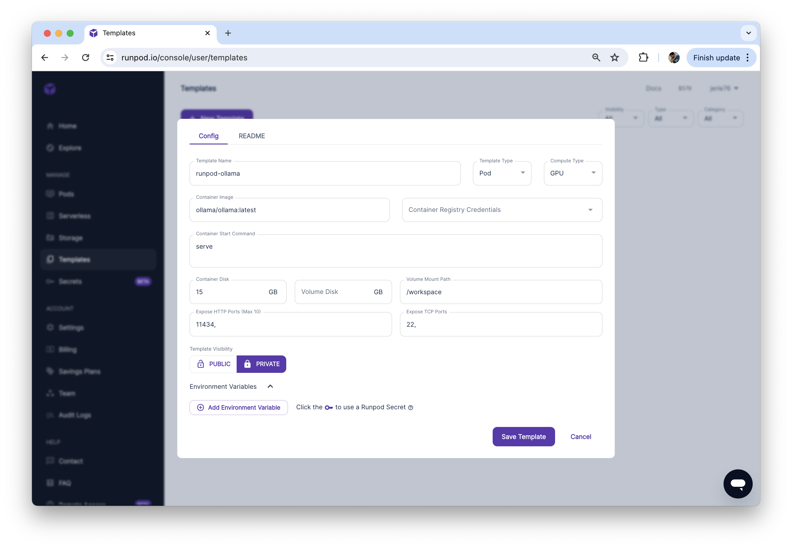
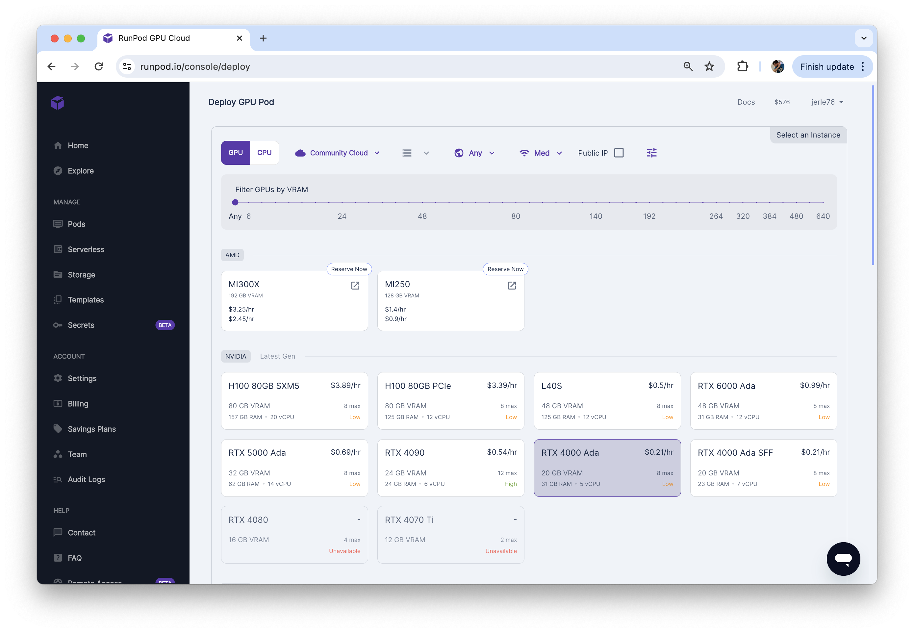
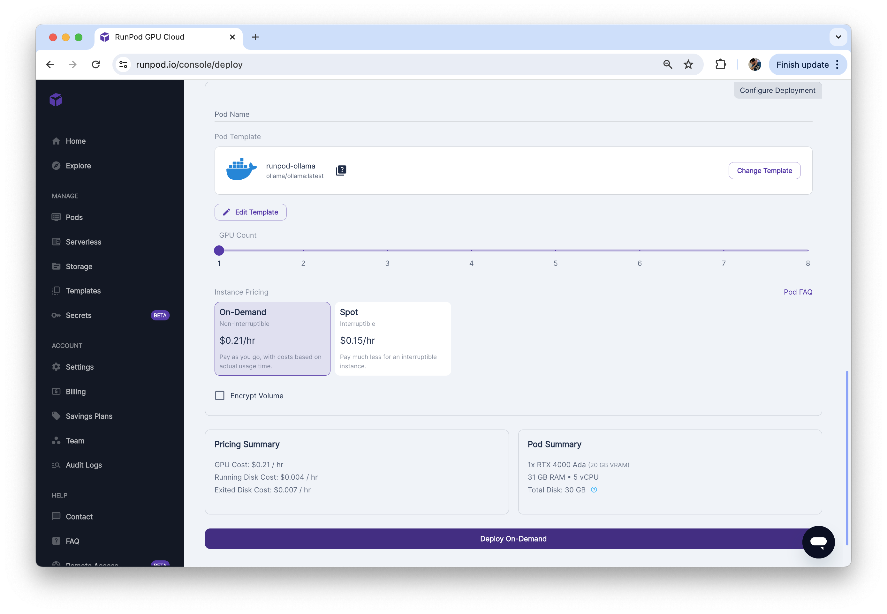

# Image Generation & Computer Vision Models play a game of Telestrations

Get text-to-image and image-to-text AI models into an infinite loop, feeding the output of one as the input of the other, thus playing an endless game of Telestrations where the first model illustrates the description of the second, while the second model describes what the first drew.



## User's corner

### Requirements
- an [OpenAI API account](https://platform.openai.com/account/organization) & API key (for DALL-E.3 & GPT4-V models),

And/or
- a [RunPod.io API account](https://www.runpod.io/console/signup) & API key (for OpenJourney, Anything, Stable Diffusion 2/XL & Kandinsky models)
- and any computer vision model running locally via [Ollama](https://ollama.ai) (for LlaVa, BakLlaVa and Moondream models).


### Getting started

1. Install Ollama and pull the computer vision models with the following commands:
```
ollama pull llava
ollama pull bakllava
ollama pull moondream
```
2. Setup and start the UI with the following commands:
```
npm install
echo '{ "OPENAI": "<YOUR API KEY HERE>", "RUNPOD": ""<YOUR API KEY HERE>" }' > api-keys.json
npm start
```
3. Visit http://localhost:8000/ with your browser
4. Enter a short description in the image prompt
5. Click the "Send" icon
6. Adjust the other prompts or model selection as needed

### Advanced: Running computer vision models in Runpod

If, like me, your computer does not have any supported GPU and is limited to CPU-only inference, running computer vision models locally is going to be extremely slow (about ~1.5min on my 2019 Intel MacBook Pro).
You can run these models on Runpod.io with the following steps:

1. In your Runpod dashboard, create a Template pulling and starting the Ollama Docker image 
2. Deploy a new GPU pod using this template 
3. Click Connect > Start Web Terminal + Connect to Web Terminal. In terminal, run `ollama pull llava; ollama pull bakllava; ollama pull moondream`
4. Pass the Rundpod ID as an environment variable when starting the proxy with this command:
```
RUNPOD_ID=<YOUR_POD_ID_HERE> npm start
```

## Developer's corner

### Architecture

```
     /www/index.html                     (basic UI)
       |
       | click Send
       v
---> /www/index.js                       (event handlers for basic UI)
|      |
|      | POST prompts & models selected
|      v
|    /src/proxy.js                       (proxy request to AI model hosting provider)
|       |
|       | POST image generation/chat completion request
|       v
|    AI model hosting provider           (e.g. OpenAI, Ollama...)
|       |
|       | return image generation/chat completion response
|       v
|    /src/proxy.js                       (proxy response to UI)
|       |
|       | return data in consistent format
|       v
---- /www/index.js
        |
        | append image/description to DOM
        v
     /www/index.html
```

### Adding new models

1. In `www/index.html`, add a radio button in the computer vision and/or image generation section(s). The input value will be referenced in the Proxy server code.
2. In `src/proxy.mjs`, add a switch case formatting input parameters appropriately for your models, and add another one parsing the response appropriately for your models. The switch case value must match the input value used at step 1.

### Running models elsewhere

So long as your AI hosting platform provides a HTTP interface to your models, all you should have to change in `www/proxy.mjs` are the endpoint and API key values prior to the Proxy server making a HTTP call to the model hosting provider.
